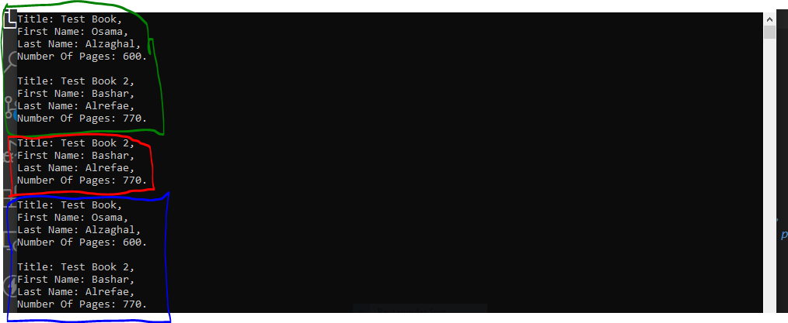

# Lab08 - Phills Lending Library


## What is this Lab talking about ?


---


***In this lab , we should construct a simple library system , that add , borrow , and returns books , to / from the library , We will use classes , interfaces and OOP principles (inheritance) to do our work , also there two methods that do the same as Add and Borrow , which are Pack and Unpack methods***


---


## what it looks like in action (Visuals) :


---





***In this image , we **added** 2 books , first one with **title : Test Book** , and author **first name : Osama** and the second one is with **title : Test Book 2** and author **first name : Bashar** , then show the library contents (the green boundary)***


***In the red boundary , we **borrowed** a book that is **Test Book** , this mean that we **deleted** a book from the library , so the remain book is with title : **Test Book 2** .***


***In the blue boundary , we **returned** the book with title : **Test Book** , so the library became as first time we added the two books , it's now contain the books with **Test Book** and **Test Book 2** titles .***


---


## How to use the app ?


---


### Add a book :

---


***to add a book , you can use **Add** method , that takes 4 parameters , which are **title** (string) , **author first name** (string) , **author last name** (string) and **pages number** (int) .***


*Example code to add a book :*


```

Library L = new Library();
L.Add("The Great Gatsby" , "Scott" , "Fitzgerald" , 163);

```

---

### Borrow a book :

---


***to borrow a book , you can use **Borrow** method , that takes 1 parameter , which is **title** (string) .***


*Example code to add a book :*


```

Book B = new Book();
B = L.Borrow("The Great Gatsby");

```

---


### Return a book :


***to return a book , you can use **Return** method , that takes 1 parameter , which is **Book** (Book) type .***


*Example code to add a book :*


```

L.Return(B);

```

### Pack a book :


***to pack a book , you can use **Pack** method , that takes 1 parameter , which is **Book** (Book) type .***


*Example code to add a book :*


```

L.Pack(B);

```


### UnPack a book :


***to unpack a book , you can use **Unpack** method , that takes 1 parameter , which is **Book** (Book) type .***


*Example code to add a book :*


```

L.Unpack(B);


```


---

